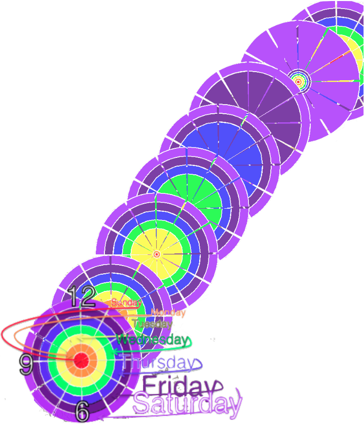
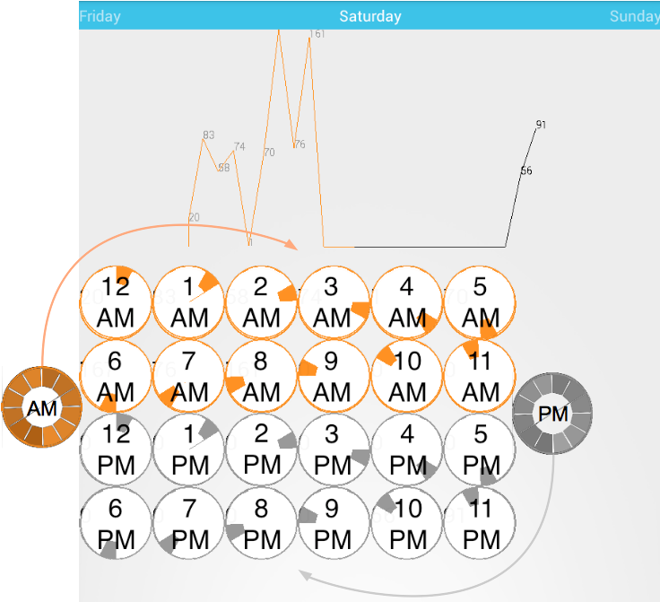
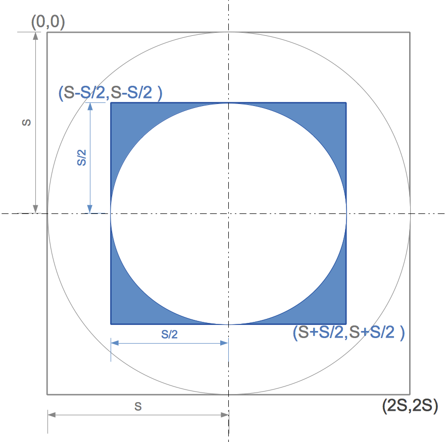
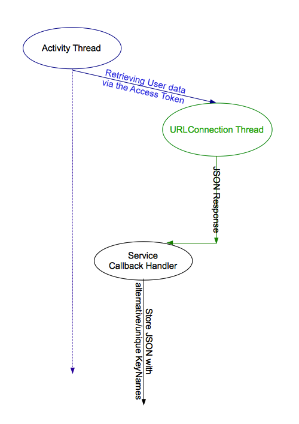
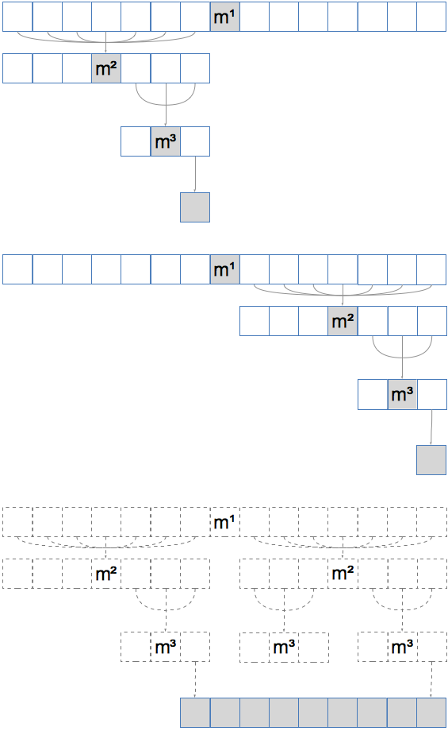
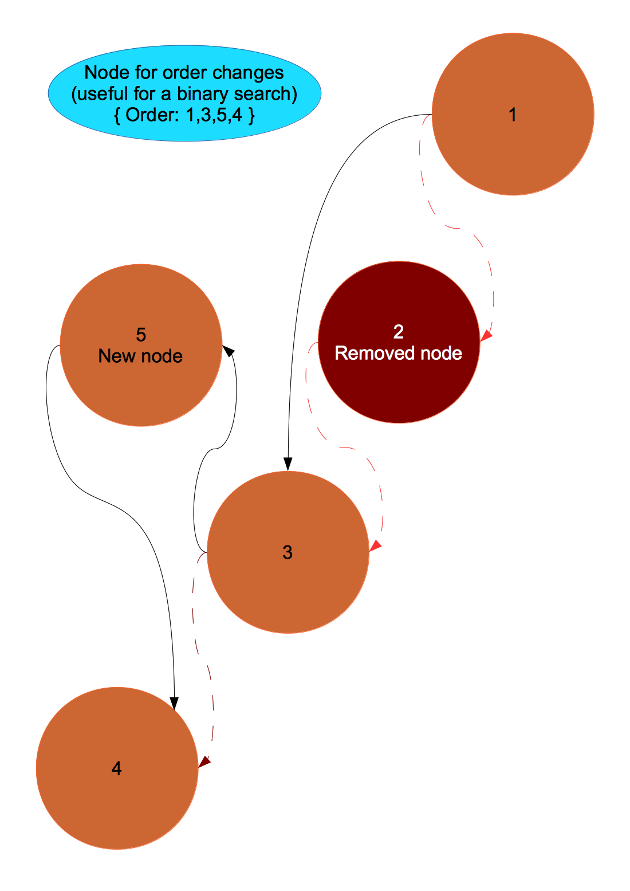

[Google Play Store](http://play.google.com/store/apps/details?id=yoga1290.bey2ollak)

Android App for building stats from previously collected traffic data from other users!

>	Please note, I'm just getting started… so, better UI & detailed code (w/out keys) later!… Feel free to issue a bug!


# Android App


## [Charts.java](android/src/yoga1290/bey2ollak/Charts.java)

This class is responsible for generating the 7 Timepiece graphs inside each other; each day is represented on a different radius…




Imagine you have 2Sx2S Canvas and want to draw a SxS Canvas in its center:


…same thing goes w the drawArc: 
```java
    canvas.drawArc(
       new RectF( S-S/2 ,S-S/2, S+S/2, S+S/2)
       ,StartAngle, 28, true, Paint);
```

… guess this gives the basic idea on what I'm doing [here](android/src/yoga1290/bey2ollak/Charts.java)

## [URLThread.java](android/src/yoga1290/bey2ollak/URLThread.java)


To prevent freezing the UI, URL connections are carried in separate threads:


This class makes it handy to startup GET/POST connection & change the UI thread on callback in a single statement, just like this:
```java
     final Activity currentActivity=this;
     new URLThread("URL HERE", new URLThread_CallBack() 
     { 
     	@Override 
     	public void URLCallBack(String response) 
     	{ 
    		//queue this back on in the UI 
    		currentActivity.runOnUiThread
    		( 
    			new Runnable() 
    			{ 
    				@Override 
    				public void run() 
    				{ 
    					findViewById(R.id.SOME_UI_Comp) 
    						.doSomething(); 
    				} 
    			} 
    		); 
    	}
    }, "Optional POST DATA HERE,otherwise GET is used").start();
```


# App Engine (Java Servlet)

## OAuth 2.0 & Social media:

I prefer using the standard OAuth 2.0 than Facebook/Foursquare or whatever API; it just increases the size of the App and if Facebook wasn’t installed, it’ll open a WebView which is identified as new browser and (in my case) asks to type the Gen-Code or the 2-step verification SMS code!
.:. so my OAuth 2.0 implementation is written separately here, [facebook.java](AppEngine/src/facebook.java) and [Foursquare.java](AppEngine/src/Foursquare.java)

### [ShareTrip.java](android/src/yoga1290/bey2ollak/ShareTrip.java):

Before sharing any post across the social media, it retrieves the required access token which is mapped to the [ANDROID_ID](http://developer.android.com/reference/android/provider/Settings.Secure.html#ANDROID_ID) + [GOOGLE ACCOUNT](http://developer.android.com/reference/android/Manifest.permission.html#GET_ACCOUNTS) from the datastore then starts another connection using the retrieved access token to share the trip


## NoSQL datastore:


Space-wise, fixed per 100-meter radius:

     Average= ( Average * Number_of_readings + New_Record) / (Number_of_readings+1)
     Number_of_readings = Number_of_readings + 1


Speed-wise, to search within a given area, I'm doing a Binary search to get the lower/higher boundaries’ indices in XY-based-sorted entities &  loop for nodes between the 2 boundaries; that depends on the number of nodes in area being used..




How I keep them sorted:
